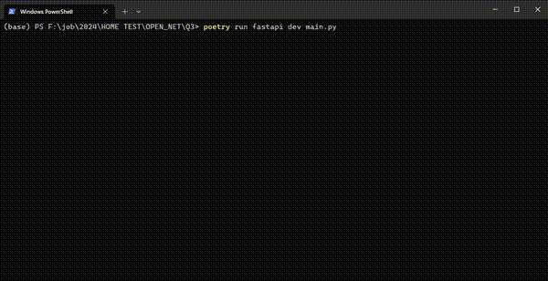

## Description
A demo of Python FastAPI

## Installing

### From Source
1. To create a virtual with poetry, install poetry:
```sh
pip install poetry
```

2. Install dependencies using `pyproject.toml`:
```sh
poetry install
```

3. run project:
```sh
poetry run fastapi dev main.py
```

### Using docker

1. Build the Docker Image:
```sh
docker build -t quest3 .
```

2. Start the Docker container:
```sh
docker run -d -p 8000:8000 --name quest3 quest3
```

## Demo
